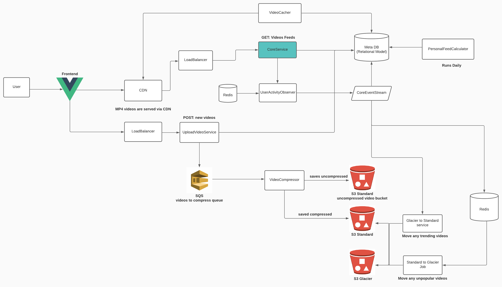

# tiktok

TikTok is a video-focused social networking service owned by Chinese company ByteDance Ltd. It hosts a variety of short-form user videos, from genres like pranks, stunts, tricks, jokes, dance, and entertainment with durations from 15 seconds to three minutes. TikTok is an international version of Douyin, which was originally released in the Chinese market in September 2016. TikTok was launched in 2017 for iOS and Android in most markets outside of mainland China; however, it became available worldwide only after merging with another Chinese social media service, Musical.ly, on 2 August 2018.

# Requirements

1. Watch short videos
2. Upload videos
3. Receive suggested video feeds

# Use cases

#### 1. Watch short videos

- Short videos are downloaded as MP4 format
- The video sizes varies but generally stays under 5mb in size
- The videos are cached in CDN and served by CDN too

#### 2. Upload videos

- Users can record video on their mobile devices for the uploads
  - User uploaded videos can be maximum 500 MB in sizes
  - Once uploaded, we will have a service to compress the video

#### 3. Receive suggested videos

- Every day, there's pre-computed list of suggested video feeds that users receive on next day
- We use Machine Learning to give best matching videos per user that they might be interested

# Constraints

1. Tiktok receives 1 billion active users per month
   1. System should be scalable for even bigger user base in the future
2. On Average, U.S. Adult users spent 33 minutes per day on Tiktok
   1. 24/7 uptime is critical in the design, we need to think about self-recovery of each component in the design. How to recover failure operation through retries or other mechanism

# Application Architecture Diagram

# Design Core Components

#### Use case: user enters the app and gets the initial video feeds

- The **User** sends a request to get the latest video feeds from **Core Service**, running as [reverse proxy](https://en.wikipedia.org/wiki/Reverse_proxy) in front of a [load balancer](https://en.wikipedia.org/wiki/Load_balancing_(computing)).
- **Core Service** queries the fresh user video feeds from **Meta DB**
- User receives a few items containing meta-data of videos including MP4 file URL
- Videos are served by [CDN](https://en.wikipedia.org/wiki/Content_delivery_network) based on the user's location

#### Use case: User uploads video

- The User records a video on a mobile device and uploads to **UploadVideoService**
  - The raw uncompressed video arrives to a raw video bucket in S3
- **VideoCompressor** receives a job to compress the video
  - The job is received through a queue (e.g. SQS)
  - **VideoCompressor** is a queue handler service that receives a new job to compressed videos through a queue
  - If compression fails, the message in the queue is retained until VideoCompressor can complete it again
  - compression here is lowering video resolution. As users with modern smartphone can record extremely high resolution videos, but when we serve videos, we want them to be served fast by lowering the file size in general
- **UploadVideoService** saves the video's meta data into database

#### Use case: old and unpopular videos moves to S3 glacier automatically

- If a video is older than 7 days and haven't received any views recently, **Standard to Glacier job** runs and moves these videos into S3 glacier for cost saving
- Such job's logic would be written like following:

1. filter_and_move_videos_to_glaicer()
   1. for all videos that are in standard S3 buckets
   2. for each video in standard S3 bucket
      1. fetch time series data for this video from Redis
      2. if this video has not been watched recently (within 7 days)
         1. move the video to glacier
         2. set this video to be archived in MetaDB

- And the job would run every day, but configurable by the system admins
- each video (that are stored in S3 standard bucket) in redis would have an array of values
  - key structure `videos/#id`
  - value structure
    - `[number, number, number, number, number]`
    - within `(5 | 30 | 1 | 7 | 30)` minutes or hours or days watch count
    - Examples
      - For an old and unpopular video `[0, 0, 0, 0, 0]`
      - For a new and popular video `[100, 50, 1000, 0, 0]`
      - For a video that is losing popularity `[0, 0, 0, 1000, 5000]`

#### Use case: Caching videos in CDN

- Caching in CDN these days would be done automatically if we are using CloudFront or similar
  - However, the automatic CDN caching requires at lease one user to actually view the video and triggers CDN to cache in lazily
- For many scenarios, we would want to eagerly cache newly uploaded videos into CDN cache so users get the latest content as fast as possible in any regions that they are watching from.
- **VideoCacher** runs every 15 minutes to force push new videos into CDN cache to achieve this

#### Use case: moving popular videos back to S3 standard

- A video that was moved to Glacier due to unpopularity suddenly receives a lot of views. In this situation, we need to move the video from Glaicer to Standard bucket class
- When core service receives a request to fetch video feeds, it sends the latest video feeds information to **UserActivityObserver** service
- **UserActivityObserver** manages a temporary key value list of currently trending videos in Redis cache store
  - When a video receives a lot of views in a short period of time, it pushes a message to **CoreEventStream** to lift its storage tier from Glacier to Standard
  - If the video is already in standard storage, the message gets ignored
  - Otherwise, **Glacier to Standard service** picks up the event and moves the video from glacier to standard tier

# Back-of-the-envelope estimation

#### [WIP] QPS and Storage requirements estimation

**Assumptions:**

- 1 billion active users per month
- 50% users use Tiktok daily
- Users post 0.05 Tiktok video per day on average
- 100% tiktok contains a media, hence it's a platform to watch short videos
- Data is stored for 5 years

**Estimations:**

1. Query per second (QPS) estimation:
   1. Daily active users (DAU) = 1 billion * 50% = 500 million
   2. Tiktok QPS = 500 million * 0.05 posts / 24 hour / 3600 seconds = ~180
   3. Peak QPS = 2 * QPS = ~360

2. Storage estimation
   1. Average tiktok post size
      1. post_id: 64 bytes
      2. title/description: 140 bytes
      3. media: 10MB
   2. Media storage
      
# Notes

1. In this document, we haven't used [more specific storage classes for S3](https://docs.aws.amazon.com/AmazonS3/latest/userguide/storage-class-intro.html) buckets apart from `standard` vs `glaicer`. `Standard` just means a bucket with fast retrieval of objects but more expensive. `Glaicer` means slow retrieval but cheaper to store.

# References

- S3 has lifecycle rule that let you specify a specific age of the object that you want to move to Glacier tier automatically https://docs.aws.amazon.com/AmazonS3/latest/userguide/intro-lifecycle-rules.html. This is a nice feature of S3 but wouldn't solve Tiktok use case's problem.

