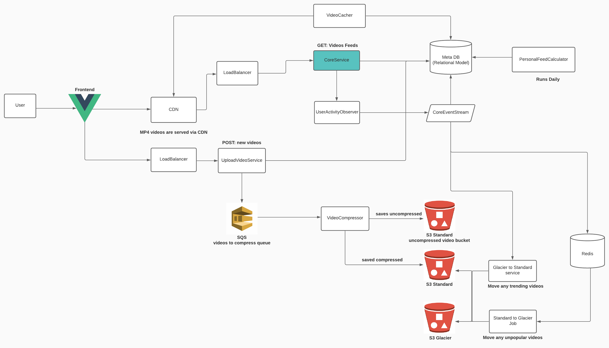

# tiktok

TikTok is a video-focused social networking service owned by Chinese company ByteDance Ltd. It hosts a variety of short-form user videos, from genres like pranks, stunts, tricks, jokes, dance, and entertainment with durations from 15 seconds to three minutes. TikTok is an international version of Douyin, which was originally released in the Chinese market in September 2016. TikTok was launched in 2017 for iOS and Android in most markets outside of mainland China; however, it became available worldwide only after merging with another Chinese social media service, Musical.ly, on 2 August 2018.

# Requirements

1. Watch short videos
2. Upload videos
3. Receive suggested video feeds

# Use cases

#### 1. Watch short videos

- Short videos are downloaded as MP4 format
- The video sizes varies but generally stays under 5mb in size
- The videos are cached in CDN and served by CDN too

#### 2. Upload videos

- Users can record video on their mobile devices for the uploads
  - User uploaded videos can be maximum 500 MB in sizes
  - Once uploaded, we will have a service to compress the video

#### 3. Receive suggested videos

- Every day, there's pre-computed list of suggested video feeds that users receive on next day
- We use Machine Learning to give best matching videos per user that they might be interested

# Constraints

1. Tiktok receives 1 billion active users per month
   1. System should be scalable for even bigger user base in the future
2. On Average, U.S. Adult users spent 33 minutes per day on Tiktok
   1. 24/7 uptime is critical in the design, we need to think about self-recovery of each component in the design. How to recover failure operation through retries or other mechanism

# Application Architecture Diagram

# Design Core Components

#### Use case: user enters the app and gets the initial video feeds

- The **User** sends a request to get the latest video feeds from **Core Service**, running as [reverse proxy](https://en.wikipedia.org/wiki/Reverse_proxy) in front of a [load balancer](https://en.wikipedia.org/wiki/Load_balancing_(computing)).
- **Core Service** queries the fresh user video feeds from **Meta DB**
- User receives a few items containing meta-data of videos including MP4 file URL
- Videos are served by [CDN](https://en.wikipedia.org/wiki/Content_delivery_network) based on the user's location

#### Use case: User uploads video

- The User records a video on a mobile device and uploads to **UploadVideoService**
  - The raw uncompressed video arrives to a raw video bucket in S3
- **VideoCompressor** receives a job to compress the video
  - **VideoCompressor** is a queue handler service that receives a new job to compressed videos through a queue
  - If compression fails, the message in the queue is retained until VideoCompressor can complete it again
  - compression here is lowering video resolution. As users with modern smartphone can record extremely high resolution videos, but when we serve videos, we want them to be served fast by lowering the file size in general
- **UploadVideoService** saves the video's meta data into database

#### Use case: old and unpopular videos moves to S3 glacier automatically

- If a video is older than 7 days and haven't received almost any views, Standard to Glacier job runs and moves these videos into S3 glacier for cost saving

1. move_any_old_videos_to_glaicer()
   1. for all videos that are in standard S3 buckets
   2. for each video in standard S3 bucket
      1. fetch time series data for this video from Redis
      2. if this video has not been watch recently (within 7 days)
         1. move the video to glacier
         2. set this video to be archived in MetaDB

- each video (that are stored in S3 standard bucket) in redis would have an array of values
  - [number, number, number, number, number]
  - within (5 | 30 | 1 | 7 | 30) mins or hours or days watch count

#### 4. VideoCacher

...

#### 5. VideoCompressor

...

#### 6. Glacier to Standard

...

#### 7. Standard to Glacier

...

