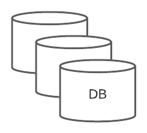
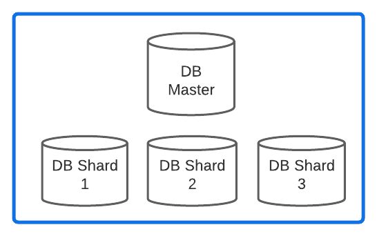
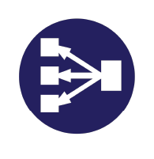
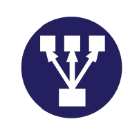

# icons used in system design diagrams

| Icon                                                   | Description              |
|--------------------------------------------------------|--------------------------|
|         | Message Queue            |
|          | Event Stream             |
|   | Database Read Replication |
|      | Database Sharded         |
|          | Cache scaled             |
|    | Load balancer left       |
|   | Load balancer right      |
|  | Load balancer bottom     |
|     | Load balancer top        |
|            | S3 Bucket red            |
|            | S3 Bucket blue           |
|        | S3 Bucket Glacier        |